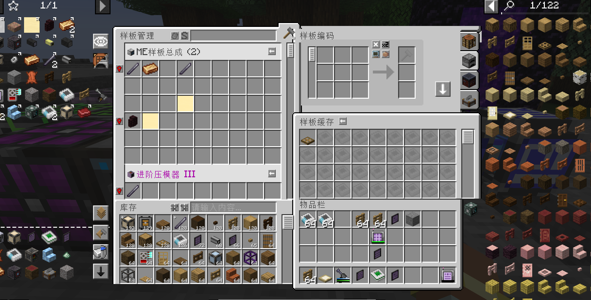

# AE2 Pattern Workstation
a mod that provides a powerful terminal to handle patterns.\
still in early test

## Credits
### Dependents
AE2\
EAE

### Reference
X2 Button from [ExpandedAE](https://github.com/ko-lja/expandedae?tab=readme-ov-file)  \
Ideas from [AE2 Things](https://github.com/asdflj/AE2Things)

### Mascot
Thanks FrostBite(https://github.com/Frostbite-time) for answering my silly questions
